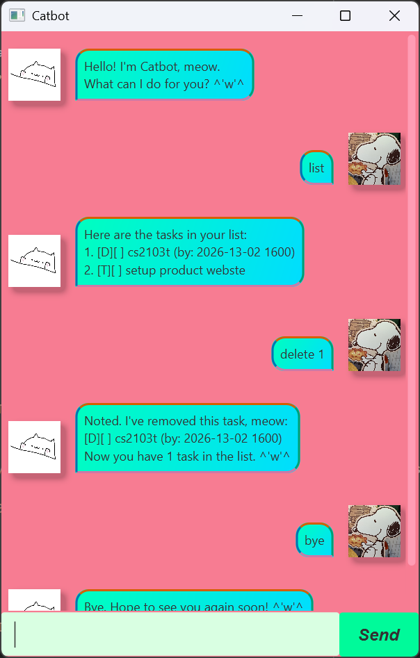

# Catbot User Guide

Catbot is a chatbot app for managing tasks. You can type messages to interact
with the chatbot. If you can type fast, Catbot can track your tasks more quickly
than traditional GUI apps.

## Adding todos

Adds a to-do task.

Format: `todo DESCRIPTION`

- The character '\|' cannot be used in the description.

Example: `todo sweep floor`

## Adding deadlines

Adds a task with a deadline.

Format: `deadline DESCRIPTION /by DATETIME`

- The character '\|' cannot be used in the description.
- Datetime should be in the format `yyyy-MM-dd HHmm`. Improper datetime is accepted and displayed as-is.

Example: `deadline read book /by 2026-02-20 1600`

## Adding events

Adds a task with a start and end time.

Format: `event DESCRIPTION /from DATETIME /to DATETIME`

- The character '\|' cannot be used in the description.
- Datetime should be in the format `yyyy-MM-dd HHmm`. Improper datetime is accepted and displayed as-is.
- The fields `/from` and `/to` may be in any order.

Example: `event walk the dog /from 2026-02-20 1500 /to 2026-02-20-1600`

## Listing all tasks

Shows a list of all tasks.

Format: `list`

## Marking tasks

Marks a task as completed.

Format: `mark INDEX`

- The index refers to the index number shown in the task list.
- The index must be a positive integer 1, 2, 3, ...

Example: `mark 1` Marks the 1st task in the list as completed.

## Unmarking tasks

Marks a task as uncompleted.

Format: `unmark INDEX`

- The index refers to the index number shown in the task list.
- The index must be a positive integer 1, 2, 3, ...

Example: `unmark 1` Marks the 1st task in the list as uncompleted.

## Updating tasks

Updates a task with a new one.

Format: `update INDEX TASK_COMMAND`

- The index refers to the index number shown in the task list.
- The index must be a positive integer 1, 2, 3, ...
- The task command should be one of `todo`, `deadline`, or `event`.
Refer to the corresponding section for the required fields.
- The new task will be unmarked.

Example: `update 1 todo wash dishes` Updates the 1st task in the list into the `todo` task `wash dishes`.

## Deleting tasks

Deletes a task from the task list.

Format: `delete INDEX`

- The index refers to the index number shown in the task list.
- The index must be a positive integer 1, 2, 3, ...

Example: `delete 1` Deletes the 1st task in the list.

## Finding tasks

Finds tasks with the given keyword in the description.

Format: `find KEYWORD`

- The search is case-sensitive.
- Only the description is searched.
- Only exact strings will be matched. e.g. `e d` will match `walk the dog` but not `edit paper`

Example: `find eat` returns `eat dinner` and `buy meat`

## Exiting the program

Exits the program.

Format: `bye`

- The program will automatically close after you press the `Enter` key.
- After sending `bye`, all further commands will be ignored.

## Saving the data

Catbot data is saved in the hard disk when you send the `bye` command
or close the app by clicking on the X button.
